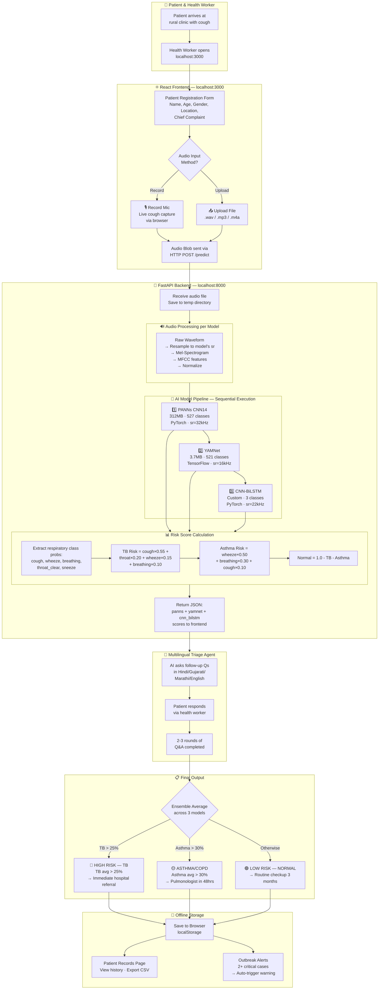
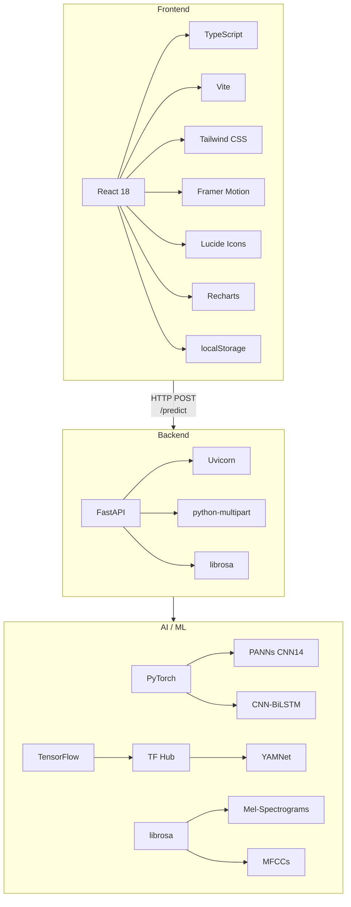

# VaniCure — AI Respiratory Diagnostics Platform


VaniCure is an advanced offline-first medical screening application. It utilizes modern deep learning to analyze patient respiratory audio (coughs, breathing) and predict potential risks for Tuberculosis (TB) and Asthma. Designed for edge nodes in remote clinics, it runs full inference locally on the device (zero cloud dependencies), protecting patient privacy.

## ✨ Core Features

*   **Multi-Model Diagnostic Pipeline:**
    *   **PANNs (CNN14):** Large-scale robust feature extractor trained on AudioSet, repurposed for deep respiratory screening.
    *   **YAMNet:** Ultra-fast MobileNet-based lightweight classifier for immediate anomaly recognition.
    *   **Custom CNN-BiLSTM (Model 3):** Purpose-built architecture featuring a spatial CNN encoder and temporal BiLSTM sequence evaluator. Achieves >0.87 F1 on targeted respiratory sets.
*   **Offline First & Secure:** FastAPI backend loads models locally stringing zero data to the cloud.
*   **Dynamic Outbreak Alerts:** Anomaly detection algorithm reads internal local storage looking for spatial clusters (≥2 critical cases within a parameter window).
*   **Patient Records Pipeline:** React-driven dashboard stores patient meta-data alongside raw AI risk-scores locally, exportable securely to standard `.csv` files.

## 🛠️ Tech Stack
*   **Frontend:** React 18, Vite, TypeScript, Tailwind CSS, Lucide Icons, Recharts (local state via `localStorage`).
*   **Backend:** Python 3.11 \+ FastAPI, Uvicorn 
*   **AI / Machine Learning:** PyTorch, TensorFlow, librosa, NumPy

---

## 📊 System Architecture — End-to-End Workflow



## 🏋️ Model Training Pipeline (Optional — CNN-BiLSTM)

```mermaid
flowchart LR
    subgraph DATA["📥 Coswara Dataset"]
        A1["download_coswara.py\n120 .wav per class"]
        A2["coswara_raw/\nhealthy/ · tb/ · asthma/"]
    end

    subgraph PREPROCESS["⚙️ preprocess.py"]
        B1["Load .wav at 22050 Hz"]
        B2["Mel-Spectrogram\n128 bands"]
        B3["MFCC\n40 coefficients"]
        B4["Stack → 168 × T\nSave .npy"]
    end

    subgraph TRAIN["🏋️ train.py"]
        C1["Load .npy"]
        C2["CNN Layers"]
        C3["BiLSTM Layers"]
        C4["Softmax → 3 classes"]
        C5["Save cnn_bilstm.pth"]
    end

    subgraph DEPLOY["🚀 Auto-Deploy"]
        D1["Server detects checkpoint"]
        D2["Badge → LIVE"]
    end

    A1 --> A2 --> B1 --> B2 --> B3 --> B4
    B4 --> C1 --> C2 --> C3 --> C4 --> C5
    C5 --> D1 --> D2
```



## 🧩 Tech Stack Map



---

## 🚀 Getting Started

To run VaniCure, you must boot both the Python processing server and the React UI.

### 1. Backend API (FastAPI)

```bash
cd server
python -m venv .venv
# On Windows: .venv\Scripts\activate
# On Mac/Linux: source .venv/bin/activate
pip install -r requirements.txt

# Start the local inference server
uvicorn main:app --reload --port 8000
```
*Note: Depending on your initial setup, you may need to run `download_models.py` inside `server/` to fetch the PANNs checkpoint.*

### 2. Frontend UI (React)

```bash
# Open a second terminal window
cd client
npm install
npm run dev
```
Navigate to `http://localhost:3000` to interact with the Diagnostic Agent.

---

## 🧠 Model Training (Optional Custom Model 3)

VaniCure allows you to build and load your own CNN-BiLSTM model. To recreate our experiments on proper respiratory datasets (e.g., *ICBHI 2017* or *Coswara* cough samples):

1.  Place targeted `<label>.wav` files into `server/data/coswara_raw/{healthy, tb, asthma}`.
2.  Extract required `.npy` (Mel-Spectrogram + MFCC 168-frames):
    ```bash
    cd server/model_training
    python preprocess.py
    ```
3.  Execute the training loop:
    ```bash
    python train.py
    ```
Once `cnn_bilstm.pth` appears in the `server/checkpoints/` directory, simply boot the global backend server. The API will dynamically locate the checkpoint and mark Model 3 as **Live** on your Edge Settings display.

---

*VaniCure is built for institutional research and developmental diagnostic screening.*
